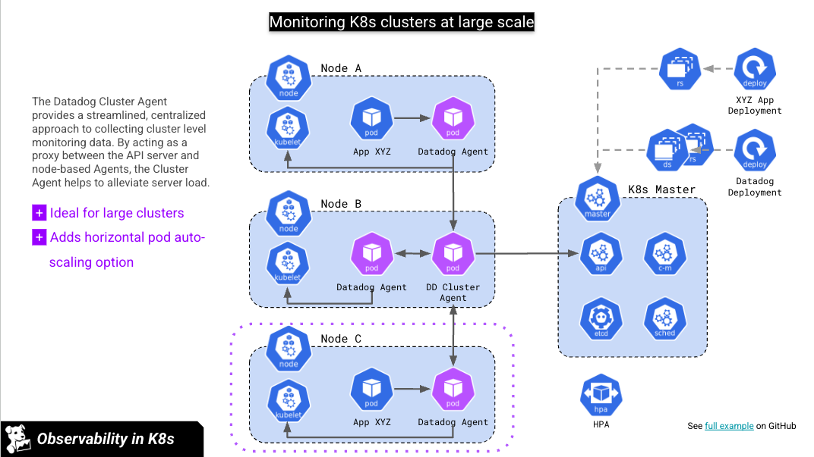

# Datadog Agent - Logs Only Collection

This configuration deploys the Datadog Agent to collect logs only from specific namespaces, with all infrastructure monitoring disabled.

## Configuration Overview

- **Logs Collection**: Enabled for `datadog-test-a` and `datadog-test-b` namespaces only
- **Infrastructure Monitoring**: Disabled (no metrics, events, or service checks)
- **Process Agent**: Disabled
- **System Probe**: Disabled

## Architecture

### Kubernetes and Datadog Agent Architecture

The Datadog Agent is deployed as a DaemonSet in Kubernetes, running one agent pod per node. This ensures comprehensive log collection across the entire cluster.



### How It Works

1. **DaemonSet Deployment**: The Datadog Agent runs as a DaemonSet, deploying one pod per node in the cluster
2. **Log Collection**: Each agent pod collects logs from containers running on its node by mounting the Docker socket and log directories
3. **Namespace Filtering**: The agent uses `containerIncludeLogs` to filter and collect logs only from specified namespaces (`datadog-test-a` and `datadog-test-b`)
4. **Log Forwarding**: Collected logs are forwarded to Datadog's US5 site (`us5.datadoghq.com`)
5. **No Metrics Collection**: All infrastructure monitoring, metrics, and system probes are disabled to reduce overhead and costs

### Components

- **Datadog Agent Pods**: Run on each node to collect logs
- **Cluster Agent**: Provides cluster-level metadata and orchestration
- **Process Agent**: Disabled in this configuration
- **System Probe**: Disabled in this configuration

This logs-only setup minimizes resource usage while providing targeted log collection from specific workloads.

## Prerequisites

- Kubernetes cluster (EKS)
- Helm 3.x installed
- Datadog API key stored in a Kubernetes secret named `datadog-secret`

## Installation

### 1. Create the Datadog Secret

```bash
kubectl create secret generic datadog-secret \
  --from-literal=api-key=<YOUR_DD_API_KEY> \
  -n datadog
```

### 2. Add the Datadog Helm Repository

```bash
helm repo add datadog https://helm.datadoghq.com
helm repo update
```

### 3. Deploy the Agent

```bash
helm install datadog -f datadog-values.yaml datadog/datadog -n datadog --create-namespace
```

Or upgrade an existing installation:

```bash
helm upgrade datadog -f datadog-values.yaml datadog/datadog -n datadog
```

## Key Configuration Settings

| Setting | Value | Purpose |
|---------|-------|---------|
| `logs.enabled` | `true` | Enable log collection |
| `logs.containerCollectAll` | `false` | Disable collection from all containers |
| `logs.autoMultiLineDetection` | `true` | Auto-detect multi-line logs (stack traces) |
| `containerIncludeLogs` | `kube_namespace:datadog-test-a kube_namespace:datadog-test-b` | Include only specific namespaces |
| `DD_LOGS_CONFIG_K8S_CONTAINER_USE_FILE` | `true` | Use file-based log collection (better performance) |
| `DD_LOGS_CONFIG_OPEN_FILES_LIMIT` | `500` | Max log files to tail simultaneously |
| `processAgent.enabled` | `false` | Disable process monitoring |
| `systemProbe.enabled` | `false` | Disable network monitoring |
| `DD_ENABLE_PAYLOADS_*` | `false` | Disable metric payloads |

## Advanced Log Features

This configuration includes several advanced log features:

- ✅ **Auto Multi-Line Detection** - Automatically aggregates stack traces and multi-line logs
- ✅ **File-Based Collection** - Better performance than Docker socket
- ✅ **Namespace Filtering** - Collect logs only from specified namespaces
- ✅ **Open Files Limit** - Prevents resource exhaustion on high-density nodes

For detailed information about all available log features, processing rules, sensitive data masking, and performance tuning, see [LOGS_FEATURES.md](LOGS_FEATURES.md).

## Verification

Check that the agent is running and collecting logs:

```bash
# Check agent pods
kubectl get pods -n datadog

# Check agent logs
kubectl logs -n datadog -l app=datadog -f

# Verify log collection status
kubectl exec -n datadog -it <agent-pod-name> -- agent status
```

## Adding More Namespaces

To collect logs from additional namespaces, update the `containerIncludeLogs` setting:

```yaml
containerIncludeLogs: "kube_namespace:namespace-1 kube_namespace:namespace-2 kube_namespace:namespace-3"
```

Then upgrade the deployment:

```bash
helm upgrade datadog -f datadog-values.yaml datadog/datadog -n datadog
```

## Adding Custom Tags to Logs

You can add custom tags to logs at different levels to better organize and filter your logs in Datadog.

### Option 1: Namespace Level Tags

Add labels to a namespace to tag all logs from that namespace:

```yaml
apiVersion: v1
kind: Namespace
metadata:
  name: datadog-test-a
  labels:
    tags.datadoghq.com/env: "production"
    tags.datadoghq.com/team: "platform"
    tags.datadoghq.com/cost-center: "engineering"
```

These labels will be automatically extracted and added as tags to all logs from pods in this namespace.

### Option 2: Deployment Level Tags

Add labels to a Deployment to tag all logs from its pods:

```yaml
apiVersion: apps/v1
kind: Deployment
metadata:
  name: my-app
  namespace: datadog-test-a
  labels:
    tags.datadoghq.com/service: "api-gateway"
    tags.datadoghq.com/version: "v1.2.3"
    tags.datadoghq.com/env: "production"
spec:
  template:
    metadata:
      labels:
        tags.datadoghq.com/service: "api-gateway"
        tags.datadoghq.com/version: "v1.2.3"
        tags.datadoghq.com/env: "production"
    spec:
      containers:
      - name: app
        image: my-app:v1.2.3
```

**Note**: Include the same labels in both `metadata.labels` and `spec.template.metadata.labels` for consistency.

### Option 3: Pod Level Tags (Using Annotations)

For more granular control, use Autodiscovery annotations on individual pods:

#### A. Tags for All Containers in a Pod

```yaml
apiVersion: v1
kind: Pod
metadata:
  name: my-app-pod
  namespace: datadog-test-a
  annotations:
    ad.datadoghq.com/tags: '{"application":"frontend", "tier":"web", "owner":"team-a"}'
spec:
  containers:
  - name: app
    image: my-app:latest
```

#### B. Tags for Specific Container (Recommended for Multi-Container Pods)

```yaml
apiVersion: v1
kind: Pod
metadata:
  name: my-app-pod
  namespace: datadog-test-a
  annotations:
    ad.datadoghq.com/app.logs: |
      [{
        "source": "nodejs",
        "service": "frontend-app",
        "tags": ["application:frontend", "tier:web", "region:us-east-1"]
      }]
    ad.datadoghq.com/sidecar.logs: |
      [{
        "source": "nginx",
        "service": "frontend-proxy",
        "tags": ["application:proxy", "tier:web"]
      }]
spec:
  containers:
  - name: app
    image: my-app:latest
  - name: sidecar
    image: nginx:latest
```

### Option 4: Global Tags (Helm Configuration)

Add tags that apply to all logs collected by the Datadog Agent:

```yaml
datadog:
  tags:
    - "env:dev"
    - "cluster:eks-prod"
    - "region:us-east-1"
    - "team:platform-engineering"
```

These tags are already configured in your `datadog-values.yaml`.

### Tag Hierarchy

Tags are applied in the following order (later tags override earlier ones):

1. **Global tags** (from Helm configuration)
2. **Namespace labels** (`tags.datadoghq.com/*`)
3. **Deployment/Pod labels** (`tags.datadoghq.com/*`)
4. **Pod annotations** (`ad.datadoghq.com/tags` or `ad.datadoghq.com/<container>.logs`)

### Unified Service Tagging (Recommended)

For consistent tagging across logs, metrics, and traces, use the unified service tagging format:

```yaml
tags.datadoghq.com/env: "production"
tags.datadoghq.com/service: "my-service"
tags.datadoghq.com/version: "v1.2.3"
```

Apply these labels at the deployment or pod level for automatic tag extraction.

### Example: Complete Deployment with Custom Tags

```yaml
apiVersion: apps/v1
kind: Deployment
metadata:
  name: checkout-service
  namespace: datadog-test-a
  labels:
    tags.datadoghq.com/service: "checkout"
    tags.datadoghq.com/env: "production"
    tags.datadoghq.com/version: "v2.1.0"
spec:
  replicas: 3
  selector:
    matchLabels:
      app: checkout
  template:
    metadata:
      labels:
        app: checkout
        tags.datadoghq.com/service: "checkout"
        tags.datadoghq.com/env: "production"
        tags.datadoghq.com/version: "v2.1.0"
      annotations:
        ad.datadoghq.com/checkout.logs: |
          [{
            "source": "java",
            "service": "checkout",
            "tags": ["business-unit:ecommerce", "payment-provider:stripe"]
          }]
    spec:
      containers:
      - name: checkout
        image: checkout-service:v2.1.0
        ports:
        - containerPort: 8080
```

This deployment will have logs tagged with:
- `env:dev` (global)
- `service:checkout` (pod label)
- `env:production` (pod label, overrides global)
- `version:v2.1.0` (pod label)
- `business-unit:ecommerce` (annotation)
- `payment-provider:stripe` (annotation)
- `source:java` (annotation)

## Reference Documentation

### Local Documentation
- [LOGS_FEATURES.md](LOGS_FEATURES.md) - Comprehensive guide to all log features, processing rules, and optimization

### Datadog Documentation
- [Datadog Kubernetes Log Collection](https://docs.datadoghq.com/containers/kubernetes/log/)
- [Auto Multi-Line Detection](https://docs.datadoghq.com/agent/logs/auto_multiline_detection/)
- [Advanced Log Collection](https://docs.datadoghq.com/agent/logs/advanced_log_collection/)
- [Container Discovery Management](https://docs.datadoghq.com/containers/guide/container-discovery-management/)
- [Logs-Only Setup Guide](https://docs.datadoghq.com/logs/guide/how-to-set-up-only-logs/)
- [Datadog Helm Chart Configuration](https://github.com/DataDog/helm-charts/tree/main/charts/datadog)
- [Datadog Agent Configuration](https://docs.datadoghq.com/agent/kubernetes/)
