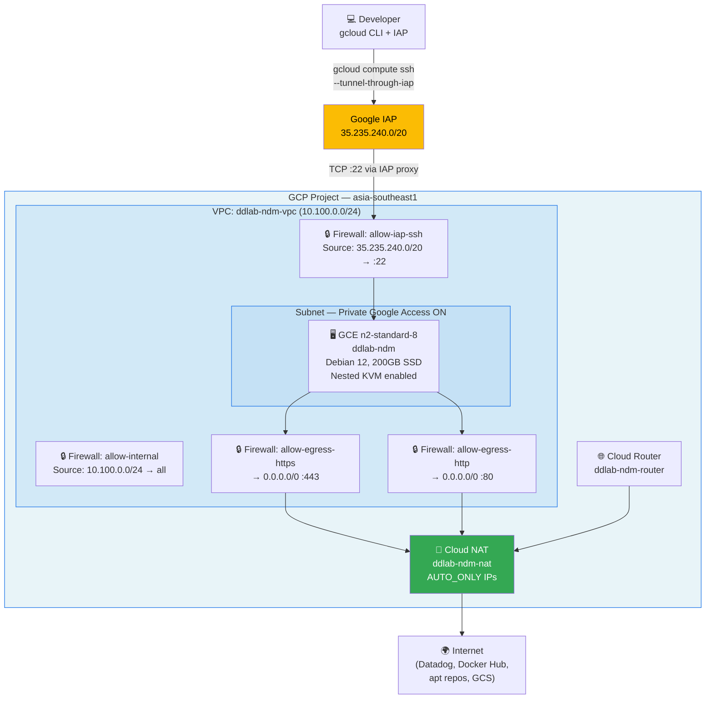
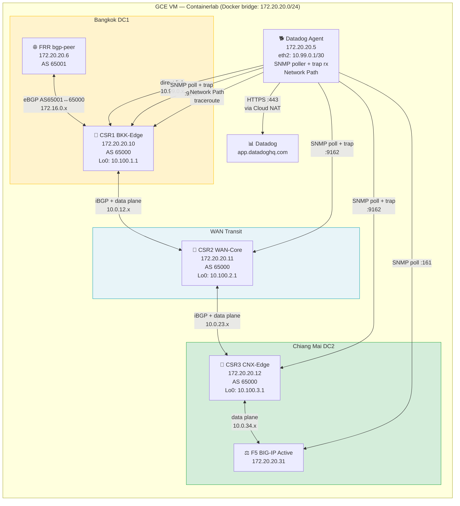
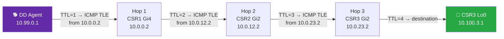

# Datadog NDM + Network Path — Containerlab Lab Automation

Terraform + bootstrap scripts to spin up a fully automated [Datadog Network Device Monitoring](https://docs.datadoghq.com/network_monitoring/devices/) lab on Google Cloud.

The lab runs inside a single GCE VM using [Containerlab](https://containerlab.dev/) + [vrnetlab](https://github.com/srl-labs/vrnetlab) to emulate real network devices, and demonstrates:

- **SNMP polling** of Cisco CSR, F5 BIG-IP, Palo Alto PA-VM
- **Network Path monitoring** (multi-hop traceroute: BKK → WAN → CNX)
- **BGP topology** (iBGP chain with FRR peer)
- **SNMP traps** (linkUp/Down, BGP state changes)
- **Geomap** (Thailand: Bangkok DC1 + Chiang Mai DC2)
- **Log collection** (container stdout, SNMP trap logs)

---

## Architecture

### GCP Infrastructure



### Lab Network Topology (inside the GCE VM)



### Network Path — Multi-Hop Traceroute



---

## Prerequisites

| Requirement | Notes |
|---|---|
| GCP account + project | N2 Intel machine type, nested virt enabled |
| Terraform ≥ 1.5 | `brew install terraform` or [tfenv](https://github.com/tfutils/tfenv) |
| Google Cloud SDK | `gcloud` CLI for IAP tunnel SSH |
| IAP permission | `roles/iap.tunnelResourceAccessor` on the project |
| Datadog account | API key from **Org Settings → API Keys** |
| VM `.qcow2` images | Cisco CSR1000v, F5 BIG-IP VE (KVM), PAN-OS PA-VM — see [VM Images](#vm-images) |
| GCS read access | `roles/storage.objectViewer` on `gs://cftd-th-gcs-fuse` (pre-staged images available) |

---

## Quick Start

### 1. Configure credentials

Secrets should **never** be committed. Use environment variables:

```bash
export TF_VAR_dd_api_key="your-datadog-api-key"
export TF_VAR_snmp_v3_auth_pass="YourSNMPAuthPass123!"
export TF_VAR_snmp_v3_priv_pass="YourSNMPPrivPass123!"
export TF_VAR_device_password="YourDeviceAdmin123!"

# Optional: F5 BIG-IP VE trial key (enables LTM VIP to shopist.io)
# If omitted, nginx reverse proxy is deployed instead
# export TF_VAR_f5_license_key="XXXXX-XXXXX-XXXXX-XXXXX-XXXXXXX"
```

Non-secret values go in `terraform.tfvars` (already gitignored):

```bash
cp terraform/terraform.tfvars.example terraform/terraform.tfvars
# Edit with your GCP project, region, SSH public key, image tags
```

### 2. Deploy GCE infrastructure

```bash
cd terraform
terraform init
terraform apply
```

Bootstrap runs automatically on first boot (~5 min to install Docker, Containerlab, vrnetlab, etc.).
Follow the log: `terraform output -raw startup_log_tail | bash`

### 3. Connect via IAP tunnel

```bash
# No public IP — all access is via Google IAP
gcloud compute ssh labuser@ddlab-ndm \
  --zone=asia-southeast1-a \
  --project=YOUR_PROJECT \
  --tunnel-through-iap
```

Or use the output:

```bash
terraform output -raw ssh_command | bash
```

### 4. Upload VM images

**Option A — Pull from GCS bucket (fastest, images already staged):**

```bash
# SSH into the instance first
gcloud compute ssh labuser@ddlab-ndm --zone=asia-southeast1-a \
  --project=YOUR_PROJECT --tunnel-through-iap

# Then inside the VM, pull from the pre-staged GCS bucket
gsutil cp gs://cftd-th-gcs-fuse/ndm/csr1000v-universalk9.16.07.01-serial.qcow2 \
  /opt/vrnetlab/cisco/csr1000v/

gsutil cp gs://cftd-th-gcs-fuse/ndm/BIGIP-16.1.6.1-0.0.11.qcow2 \
  /opt/vrnetlab/f5_bigip/

gsutil cp gs://cftd-th-gcs-fuse/ndm/PA-VM-KVM-11.0.0.qcow2 \
  /opt/vrnetlab/paloalto/pan/
```

**Option B — SCP your own licensed images via IAP:**

```bash
gcloud compute scp --tunnel-through-iap --zone=asia-southeast1-a \
  csr1000v-universalk9.16.07.01-serial.qcow2 \
  labuser@ddlab-ndm:/opt/vrnetlab/cisco/csr1000v/

gcloud compute scp --tunnel-through-iap --zone=asia-southeast1-a \
  BIGIP-16.1.6.1-0.0.11.qcow2 \
  labuser@ddlab-ndm:/opt/vrnetlab/f5_bigip/

gcloud compute scp --tunnel-through-iap --zone=asia-southeast1-a \
  PA-VM-KVM-11.0.0.qcow2 \
  labuser@ddlab-ndm:/opt/vrnetlab/paloalto/pan/
```

### 5. Build vrnetlab container images (~20–30 min)

The `build-images.sh` script expects images in the correct vrnetlab source directories:

```bash
sudo bash /opt/ddlab/scripts/build-images.sh
```

> **Note:** If you see `[SKIP] No *.qcow2 found`, the build script may reference old paths.
> Check `/opt/ddlab/scripts/build-images.sh` — directories should be
> `cisco/csr1000v`, `f5_bigip`, `paloalto/pan`. Edit if needed.

Verify builds succeeded:

```bash
sudo docker images | grep vrnetlab
# Expected:
# vrnetlab/cisco_csr1000v:16.07.01       ~2.4 GB
# vrnetlab/f5_bigip-ve:16.1.6.1-0.0.11  ~9.7 GB
# vrnetlab/paloalto_pa-vm:11.0.0         ~8.9 GB
```

### 6. Deploy Containerlab topology

```bash
# Add QEMU_CPU: host to PAN-OS node (required for PA-VM 11.x performance)
sudo python3 -c "
content = open('/opt/ddlab/containerlab/ndm-lab.clab.yml').read()
old = '      mgmt-ipv4: 172.20.20.20'
new = '      mgmt-ipv4: 172.20.20.20\n      env:\n        QEMU_CPU: host'
if old in content and 'QEMU_CPU' not in content:
    open('/opt/ddlab/containerlab/ndm-lab.clab.yml', 'w').write(content.replace(old, new))
    print('Patched')
"

sudo containerlab deploy --topo /opt/ddlab/containerlab/ndm-lab.clab.yml
```

Wait for VMs to boot (CSR ~3 min, F5 ~5 min, PAN-OS ~10 min with `QEMU_CPU: host`):

```bash
# Monitor boot progress
for c in csr csr2 csr3 bigip-active; do
  echo "$c: $(sudo docker logs clab-ddlab-ndm-$c 2>&1 | grep 'Startup complete' | tail -1)"
done
```

### 7. Post-deployment: configure network devices

Once all VMs show `Startup complete`, run these configuration steps:

**CSR routers** — configure SNMP and return routes via SSH:

```bash
SSH_OPTS="-o StrictHostKeyChecking=no -o KexAlgorithms=+diffie-hellman-group14-sha1 -o HostKeyAlgorithms=+ssh-rsa -o Ciphers=+aes128-cbc,aes256-cbc"

# CSR1 — SNMP + BGP (startup config auto-applies on boot; just save)
sshpass -p "admin" ssh $SSH_OPTS admin@172.20.20.10 "wr mem" 2>/dev/null

# CSR2 — add return route so SNMP trap responses reach dd-agent
sshpass -p "admin" ssh $SSH_OPTS admin@172.20.20.11 << 'EOF'
configure terminal
ip route 10.99.0.0 255.255.255.252 10.0.12.1
end
wr mem
EOF

# CSR3 — add return route
sshpass -p "admin" ssh $SSH_OPTS admin@172.20.20.12 << 'EOF'
configure terminal
ip route 10.99.0.0 255.255.255.252 10.0.23.1
end
wr mem
EOF
```

**F5 BIG-IP** — SNMP is configured automatically by `configure-devices.sh`.

**F5 LTM (optional)** — requires a license key. If `f5_license_key` is set in `terraform.tfvars`, the bootstrap script licenses the F5 and creates:
- VIP `192.168.30.100:80` forwarding to `https://shopist.io` (Datadog demo store)
- Pool with round-robin load balancing across shopist.io CDN IPs
- Server-SSL profile for TLS termination to the backend

If no license key is provided, an **nginx reverse proxy** is deployed instead at `172.20.20.100:80` with the same shopist.io backend.

```bash
# To license F5 manually after deployment:
export TF_VAR_f5_license_key="XXXXX-XXXXX-XXXXX-XXXXX-XXXXXXX"
# Or set in terraform.tfvars:
# f5_license_key = "XXXXX-XXXXX-XXXXX-XXXXX-XXXXXXX"
```

### 8. Post-deployment: configure the host Datadog agent

Install and configure the Datadog agent directly on the GCE host (not in a container):

```bash
# Install agent
DD_API_KEY="your-dd-api-key" DD_SITE="datadoghq.com" \
  bash -c "$(curl -L https://install.datadoghq.com/scripts/install_script_agent7.sh)"

# Configure namespace
sudo tee -a /etc/datadog-agent/datadog.yaml > /dev/null << 'EOF'

network_devices:
  namespace: lab-th

logs_config:
  container_collect_all: true
EOF

# Copy SNMP + Network Path configs from the lab directory
sudo cp /opt/ddlab/conf.d/snmp.d/instances.yaml \
  /etc/datadog-agent/conf.d/snmp.d/instances.yaml
sudo mkdir -p /etc/datadog-agent/conf.d/network_path.d
sudo cp /opt/ddlab/conf.d/network_path.d/conf.yaml \
  /etc/datadog-agent/conf.d/network_path.d/conf.yaml

# Enable system-probe traceroute module (required for Network Path multi-hop)
sudo tee /etc/datadog-agent/system-probe.yaml > /dev/null << 'EOF'
system_probe_config:
  enabled: true

network_path:
  enabled: true

traceroute:
  enabled: true
EOF
sudo chown dd-agent:dd-agent /etc/datadog-agent/system-probe.yaml
sudo chmod 640 /etc/datadog-agent/system-probe.yaml

# Enable system-probe service and restart
sudo systemctl enable datadog-agent-sysprobe
sudo systemctl start datadog-agent-sysprobe
sudo systemctl restart datadog-agent

# Verify
sudo datadog-agent status 2>&1 | grep -E "API key|snmp:lab-th|network_path" | head -10
```

### 9. Post-deployment: configure network routing

These routes enable the Datadog agent to reach the data plane IPs (for multi-hop Network Path):

```bash
# Host route: 10.0.0.0/8 via CSR1 management (for SNMP polls to CSR loopbacks)
BRIDGE=$(ip route show 172.20.20.0/24 | awk '{print $3}')
sudo ip route add 10.0.0.0/8 via 172.20.20.10 dev "$BRIDGE"

# dd-agent container eth2: direct data plane link to CSR1 Gi4
# (enables accurate multi-hop traceroute from 10.99.0.1 through CSR1→CSR2→CSR3)
DDPID=$(sudo docker inspect clab-ddlab-ndm-dd-agent --format '{{.State.Pid}}')
sudo nsenter -n -t "$DDPID" -- ip addr add 10.99.0.1/30 dev eth2
sudo nsenter -n -t "$DDPID" -- ip route add 10.0.0.0/8 via 10.99.0.2 dev eth2

# Verify multi-hop traceroute (should show 3 hops)
sudo nsenter -n -t "$DDPID" -- traceroute -I -n -m 6 -w 2 10.100.3.1
# Expected:
#  1  10.99.0.2   (CSR1 Gi4)    ~1ms
#  2  10.0.12.2   (CSR2 Gi2)    ~1ms
#  3  10.100.3.1  (CSR3 Lo0)    ~2ms
```

> **After reboots:** The host route and dd-agent eth2 IP are not persistent. Re-run this step after a GCE restart or Containerlab redeploy.

### 10. Validate

```bash
sudo datadog-agent status 2>&1 | grep -E "snmp:lab-th|network_path:|OK\]|ERROR\]" | head -20
```

Expected: all `snmp:lab-th:172.20.20.1x` and `network_path:` instances show `[OK]`.

---

## Connecting to Datadog

| Product | URL |
|---|---|
| NDM Devices | https://app.datadoghq.com/devices |
| NDM Topology | https://app.datadoghq.com/devices/topology |
| NDM Geomap | https://app.datadoghq.com/devices/geomap |
| Network Path | https://app.datadoghq.com/network/path |
| SNMP Trap Logs | https://app.datadoghq.com/logs?query=source:snmp-traps |

---

## Network Observability Demo

See **[NETWORK-OBSERVABILITY.md](NETWORK-OBSERVABILITY.md)** for the full demo playbook covering:

- **In-transit hop latency spike** — inject WAN latency on CSR2, visible in Network Path
- **Device reachability / packet loss** — simulate lossy links
- **BGP routing flapping** — cause eBGP/iBGP session flaps with SNMP traps
- **Interface down (linkDown trap)** — shut/restore interfaces with SNMP trap generation
- **Device CPU high** — spike router CPU utilization
- **Device uptime / reboot detection** — monitor sysUpTime resets
- **Packet drop counters** — interface error/discard counter increases
- **Combined WAN degradation demo** — all faults at once

Quick start on the GCE VM:

```bash
# Interactive menu with all scenarios
sudo bash /opt/ddlab/scripts/simulate-network-faults.sh

# Or run individual scripts directly:
sudo bash /opt/ddlab/scripts/simulate-latency.sh on 200 50
sudo bash /opt/ddlab/scripts/simulate-bgp-flap.sh
sudo bash /opt/ddlab/scripts/simulate-latency.sh off
```

---

## Thailand Geomap Locations

| Tag | Location | Lat | Lon | Devices |
|---|---|---|---|---|
| `bkk-dc1` | Bangkok DC1 | 13.7563 | 100.5018 | CSR1 Router, PA-VM Firewall |
| `cnx-dc2` | Chiang Mai DC2 | 18.7883 | 98.9853 | F5 Active, F5 Standby |

After `deploy-lab.sh`, add coordinate mappings in:  
**Datadog → NDM → Settings → Geomap → + Add Mapping**

Or import the CSV:
```bash
# Path on the VM
cat /opt/ddlab/geomap-locations.csv
```

---

## Directory Structure

```
ddlab-automation/
├── .gitignore                   # Excludes terraform.tfvars, *.tfstate, *.qcow2
├── README.md                    # This file
├── NETWORK-OBSERVABILITY.md     # Demo playbook: fault simulation & monitoring guide
├── terraform/
│   ├── main.tf                  # VPC, Cloud NAT, IAP firewall, GCE instance
│   ├── variables.tf             # All input variables with descriptions + validation
│   ├── outputs.tf               # IAP SSH commands, NAT name, Datadog URLs
│   ├── terraform.tfvars         # YOUR VALUES — gitignored, never commit
│   └── terraform.tfvars.example # Template — safe to commit
└── scripts/
    └── startup.sh.tpl           # Bootstrap template rendered by Terraform
```

On the deployed GCE instance, all lab files are under `/opt/ddlab/`:

```
/opt/ddlab/
├── containerlab/
│   └── ndm-lab.clab.yml         # Containerlab topology (3×CSR + F5 + Agent)
├── configs/
│   ├── csr-startup.cfg          # CSR1 IOS — SNMP, BGP, IAP trap routing
│   ├── csr2-startup.cfg         # CSR2 IOS — iBGP, SNMP
│   ├── csr3-startup.cfg         # CSR3 IOS — iBGP, SNMP, default route
│   └── frr.conf                 # FRR bgp-peer — eBGP to CSR1 AS 65001
├── conf.d/
│   ├── snmp.d/
│   │   ├── instances.yaml       # Per-device SNMP config with geo tags
│   │   └── traps_db/
│   │       └── cisco-ios-traps.json  # OID → trap name mappings
│   └── network_path.d/
│       └── conf.yaml            # Network Path targets (3-hop chain)
├── datadog.yaml                 # Agent config (namespace, snmp_traps, logs)
├── system-probe.yaml            # Traceroute module config
├── geomap-locations.csv         # Bangkok + Chiang Mai for Datadog UI import
└── scripts/
    ├── build-images.sh               # Build vrnetlab containers from qcow2
    ├── deploy-lab.sh                 # Deploy topology + configure devices
    ├── configure-devices.sh          # SSH-configure SNMP/BGP on each device
    ├── register-geomap.sh            # Tag devices with geo OIDs + print UI steps
    ├── validate.sh                   # End-to-end lab health check
    ├── teardown.sh                   # Destroy topology (keep VM images)
    ├── simulate-network-faults.sh    # Interactive menu for all fault scenarios
    ├── simulate-latency.sh           # WAN latency injection (tc netem)
    ├── simulate-packet-loss.sh       # Packet loss injection
    ├── simulate-bgp-flap.sh          # BGP session flapping
    ├── simulate-interface-down.sh    # Interface down/up/flap
    └── simulate-cpu-stress.sh        # Device CPU stress
```

---

## Security

| Control | Implementation |
|---|---|
| **No public IP** | GCE instance has no `access_config`; internet via Cloud NAT |
| **IAP-only SSH** | Firewall allows TCP:22 only from `35.235.240.0/20` (Google IAP) |
| **Secrets management** | All sensitive vars use `sensitive = true`; set via env vars, not files |
| **gitignore** | `terraform.tfvars`, `*.tfstate`, SSH keys, `.qcow2` images all excluded |
| **Private Google Access** | Subnet has PGA enabled (GCS, Artifact Registry without public IP) |
| **Block project SSH keys** | `block-project-ssh-keys = true` in instance metadata |

> ⚠️ The startup script embeds credentials into the GCE metadata payload. Anyone with `compute.instances.get` can read it. For production, use Secret Manager and retrieve secrets at runtime.

---

## Cost Estimate (asia-southeast1)

| Resource | Cost | Notes |
|---|---|---|
| n2-standard-8 (running) | ~$0.39/hr | Stop between sessions to save cost |
| n2-standard-8 (stopped) | $0/hr | No charge when stopped |
| 200 GB pd-ssd | ~$34/mo | Persistent — survives stop/start |
| Cloud NAT | ~$0.044/hr + data | Only when instance is running |

**Tip:** Stop the instance between sessions:
```bash
gcloud compute instances stop ddlab-ndm --zone=asia-southeast1-a
gcloud compute instances start ddlab-ndm --zone=asia-southeast1-a
```

---

## Teardown

```bash
# Destroy lab topology only (keeps GCE instance + disk + images)
gcloud compute ssh labuser@ddlab-ndm --tunnel-through-iap -- \
  'sudo containerlab destroy --topo /opt/ddlab/containerlab/ndm-lab.clab.yml --cleanup'

# Destroy GCE instance (disk is kept — auto_delete = false)
cd terraform && terraform destroy

# Manually delete the boot disk if no longer needed
gcloud compute disks delete ddlab-ndm --zone=asia-southeast1-a
```

---

## VM Images

### Pre-staged GCS Bucket

The following images are pre-staged in a shared GCS bucket and can be pulled directly into the GCE VM without uploading from your laptop:

| File | Device | Size | GCS Path |
|---|---|---|---|
| `csr1000v-universalk9.16.07.01-serial.qcow2` | Cisco CSR1000v 16.07.01 | ~844 MB | `gs://cftd-th-gcs-fuse/ndm/` |
| `BIGIP-16.1.6.1-0.0.11.qcow2` | F5 BIG-IP VE 16.1.6.1 | ~6.1 GB | `gs://cftd-th-gcs-fuse/ndm/` |
| `PA-VM-KVM-11.0.0.qcow2` | Palo Alto PA-VM 11.0.0 | ~3.8 GB | `gs://cftd-th-gcs-fuse/ndm/` |

**Required IAM:** `roles/storage.objectViewer` on the bucket or project.

```bash
# List available images
gsutil ls gs://cftd-th-gcs-fuse/ndm/

# Pull all three in parallel (run inside the GCE VM)
gsutil cp gs://cftd-th-gcs-fuse/ndm/csr1000v-universalk9.16.07.01-serial.qcow2 \
  /opt/vrnetlab/cisco/csr1000v/ &
gsutil cp gs://cftd-th-gcs-fuse/ndm/BIGIP-16.1.6.1-0.0.11.qcow2 \
  /opt/vrnetlab/f5_bigip/ &
gsutil cp gs://cftd-th-gcs-fuse/ndm/PA-VM-KVM-11.0.0.qcow2 \
  /opt/vrnetlab/paloalto/pan/ &
wait && echo "All images downloaded"
```

### Expected vrnetlab Build Output

After running `build-images.sh`, these Docker images should exist:

```
vrnetlab/cisco_csr1000v:16.07.01       ~2.4 GB
vrnetlab/f5_bigip-ve:16.1.6.1-0.0.11  ~9.7 GB
vrnetlab/paloalto_pa-vm:11.0.0         ~8.9 GB
```

Verify with: `sudo docker images | grep vrnetlab`

---

## Troubleshooting

| Symptom | Fix |
|---|---|
| IAP tunnel fails | Ensure `roles/iap.tunnelResourceAccessor` on your Google account |
| Bootstrap stuck | `tail -f /var/log/ddlab-startup.log` via IAP SSH |
| Containerlab not found after bootstrap | Bootstrap uses `apt.fury.io/netdevops` repo; if missing run: `sudo apt-get install -y containerlab` |
| `build-images.sh` shows `[SKIP]` | Edit script — directories must be `cisco/csr1000v`, `f5_bigip`, `paloalto/pan` not `csr`/`pan` |
| CSR SNMP timeout | Check `snmp-server community dd-snmp-ro RO ACL-SNMP` and ACL permits `172.20.20.0 0.0.0.255` |
| F5 SNMP timeout | Re-run REST API config: `allowedAddresses` must include `172.20.20.0/24`; wait ~3 min for F5 to initialize |
| No SNMP traps in Datadog | Traps route via `vrf clab-mgmt` — check `show snmp host` shows `172.20.20.5:9162`; check `ip route vrf clab-mgmt` has `172.20.20.0/24` |
| Network Path all `[ERROR]` | system-probe not running — check `systemctl status datadog-agent-sysprobe`; verify `traceroute: enabled: true` in `system-probe.yaml` |
| Network Path shows 1 hop | dd-agent eth2 IP lost after container restart — re-run Step 9 routing commands |
| Network Path hops are `* * *` | CSR2/CSR3 return routes missing — re-add `ip route 10.99.0.0 255.255.255.252 <upstream>` |
| PAN-OS stuck at `vm login:` | Set `QEMU_CPU: host` in the PAN-OS node's `env:` block in the topology file |
| PAN-OS SNMP unreachable | PAN-OS uses QEMU user-mode networking (SLiRP) — SNMP UDP is unreliable through it; monitor via REST API instead |
| F5 REST API returns 401 | Password is `LabAdmin@2024!` (set via vrnetlab `PASSWORD` env var); F5 may still be booting |
| `gsutil cp` fails | Verify `roles/storage.objectViewer` on `gs://cftd-th-gcs-fuse`; run `gcloud auth application-default login` |
| After GCE reboot: SNMP/NP broken | Re-run Steps 7–9 (device config + host route + eth2 IP are not persistent across reboots) |
